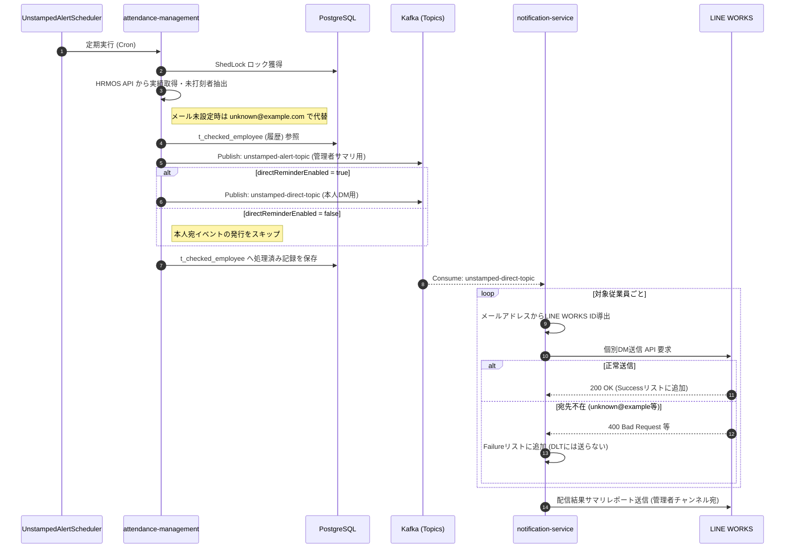

# システム総合アーキテクチャおよび運用リファレンス

本ドキュメントは、勤怠管理システム（`attendance-management`）および通知サービス（`notification-service`）から構成されるエンタープライズ・マイクロサービスアーキテクチャの総合ドキュメントです。
開発環境および本番稼働において、各コンポーネントがどのように協調動作し、データを連携するかを明確化します。

---

## 1. システム概要とアーキテクチャ全体図

当システムは、HRMOS API から取得した勤怠・マスタデータをローカルDBに統合・集計する「勤怠管理サービス」と、抽出された業務イベント（未打刻、勤怠不良など）を非同期で受け取り LINE WORKS 等へ配送する「通知サービス」の 2 つの Spring Boot 3 / Java 25 アプリケーションで構成されています。

```mermaid
graph TD
    subgraph "Docker Compose Network (local-app-network)"
        WireMock[WireMock<br>:8089]
        
        subgraph "Spring Boot Applications"
            Attend[attendance-management<br>ポート: 8180]
            Notice[notification-service<br>ポート: 8181]
        end

        DB[(PostgreSQL 16<br>ポート: 5432)]
        Kafka[Kafka KRaft<br>ポート: 9092]
        KafkaUI[Kafka-UI<br>ポート: 8080]

        Attend -->|JDBC / jOOQ<br>Flyway| DB
        Attend -->|ShedLock 分散ロック| DB
        Attend -->|HTTP (Mock)| WireMock
        Attend -->|Publish イベント| Kafka
        Kafka -->|Consume (自動リトライ/DLT)| Notice
    end
    
    HRMOS[(HRMOS API)] -.->|Real API| Attend
    Notice -->|HTTP (JWT Bearer)| LineWorks[(LINE WORKS API)]
```

---

## 2. 各マイクロサービスの責務一覧

### 🏢 attendance-management (勤怠管理サービス)
HRMOS 上のデータを正としつつ、ローカルマスタと突合してインテリジェントな勤怠イベントを抽出・集計するコアエンジン。
- **外部データ同期**: HRMOS API と通信し、従業員マスタ、部門・勤務区分マスタ、日次・月次勤怠実績を同期・洗い替え。
- **スケジューリング**: `@Scheduled` アノテーションによるバッチ処理を定義。ShedLock による DB ロック（`shedlock` テーブル）を用い、複数コンテナ稼働時の多重実行を防止。
- **未打刻検知と状態管理**: 実績と予定時刻を比較し未打刻者を判定（`DailyAttendance`）。重複通知を防ぐため、通知履歴を `t_checked_employee` テーブルへ保存。
- **メッセージ配信**: Kafka トピックへ各種イベント（`unstamped-alert-topic`, `unstamped-direct-topic` など）を Publish。

### ✉️ notification-service (通知サービス)
他サービスからの通知要求を受け付け、設定されたプラットフォームへ安全かつ確実にメッセージを配送する独立したゲートウェイ。
- **メッセージング購読**: `attendance-management` からのイベントを Spring Kafka で非同期 Consume し、ドメインフォーマッタで視認性の高いメッセージに整形。
- **LINE WORKS 連携**: JWT（JSON Web Token）による Service Account 認証を動的に行い、管理者チャンネルやユーザー個別 DM へメッセージを送信。
- **フォールトトレランス設計**:
    - メッセージ処理失敗時は指数バックオフ（Exponential Backoff）による自動リトライを実行。
    - バリデーションエラーや上限超過時は DLT（Dead Letter Topic）へ退避。`DltErrorHandler` が Kafka ヘッダから原因を抽出し、システム管理者（`systemManagerId`）へ 2 次障害を防ぐ形で一次報を通知。

### 🐳 インフラコンポーネント (Docker Compose)
- **PostgreSQL (16-alpine)**: 勤怠データやマスタ、ShedLock、月次サマリなどを永続化するメインDB。
- **Apache Kafka (KRaft モード)**: ZooKeeper 不要のモダンな Kafka ブローカー。サービス間のイベントを非同期で中継。
- **Kafka-UI**: Kafka のトピック状態やメッセージペイロードをブラウザから視覚的に監視できるツール。
- **WireMock**: 開発環境（`compose.app.dev.yaml`）において、HRMOS API の振る舞いをモック化するためのサーバー。

---

## 3. サービス間非同期連携の全体データフロー（最新実装仕様）

直近の改修により、**「未打刻DM無効時の管理者代理通知」** および **「メール未設定時のフォールバック」** が実装されています。

- **DM制御仕様**: `app.kafka.direct-reminder-enabled = false` の場合、本人向けDM用のトピック（`unstamped-direct-topic`）への Publish が完全にスキップされます。管理者はサマリアラート（`unstamped-alert-topic`）を受信し、代理で状況確認を行います。
- **フォールバック挙動**: 従業員のメールアドレスが未設定（null）の場合、`attendance-management` 側で `unknown@example.com` に代替して発火します。`notification-service` の LINE WORKS アカウント解決ロジックにより `unknown@example` となりますが、当然 ID が存在しないため送信エラーとなります。このエラーは DLT には落ちず、安全にスキップ（FailureItem に追加）され、**「配信結果レポート」内の失敗リストとして管理者に報告**されます。



---

## 4. ポートマッピング一覧

Docker Compose 環境における、各コンテナの内部ポートとホスト公開ポートの一覧です。

| コンテナ名 | サービス / 用途 | 内部ポート | ホスト公開ポート | アクセスURL (ローカル環境) |
| :--- | :--- | :--- | :--- | :--- |
| `attendance-app` | 勤怠管理サービス REST API | 8081 | **8180** | `http://localhost:8180/swagger-ui.html` |
| `notification-app` | 通知サービス REST API | 8081 | **8181** | `http://localhost:8181/swagger-ui.html` |
| `postgres` | PostgreSQL データベース | 5432 | **5432** | `jdbc:postgresql://localhost:5432/` |
| `kafka` | Apache Kafka ブローカー | 9092 | **9092** | `localhost:9092` |
| `kafka-ui` | Kafka 管理 UI | 8080 | **8080** | `http://localhost:8080` |
| `wiremock` | HRMOS モックサーバー | 8089 | **8089** | `http://localhost:8089` |

---

## 5. 環境変数一覧表

システム全体を制御する主要な環境変数（`.env` / `application.yaml` バインド用）です。

### 共通・インフラ系設定
| 環境変数名 | 用途・設定内容 | デフォルト値 / 適用先 |
| :--- | :--- | :--- |
| `SERVER_PORT` | Spring Boot アプリケーションの動作ポート | `8081` (両アプリ共通) |
| `KAFKA_BOOTSTRAP_SERVERS` | Kafka クラスターの接続先情報 | `shared-kafka:9092` |
| `DB_HOST` / `DB_PORT` | データベース接続ホストおよびポート | `localhost` / `5432` |
| `DB_NAME` / `DB_USERNAME` / `DB_PASSWORD` | PostgreSQL 接続情報 | 環境依存 |
| `SPRING_FLYWAY_ENABLED` | 起動時の Flyway マイグレーション実行有無 | `true` |

### 連携 API 設定 (HRMOS & LINE WORKS)
| 環境変数名 | 用途・設定内容 | 適用先 |
| :--- | :--- | :--- |
| `HRMOS_COMPANY_URL` | HRMOS API リクエスト時のテナント識別文字列 | `attendance-management` |
| `HRMOS_SECRET_KEY` | HRMOS API Basic 認証シークレットキー | `attendance-management` |
| `LW_CLIENT_ID` / `LW_CLIENT_SECRET` | LINE WORKS アプリケーション認証情報 | `notification-service` |
| `LW_SERVICE_ACCOUNT` / `LW_PRIVATE_KEY_PATH` | Server-to-Server 認証用 Service Account と秘密鍵パス | `notification-service` |
| `LW_BOT_ID` | LINE WORKS メッセージ動作用 Bot ID | `notification-service` |
| `LW_ALERT_CHANNEL_ID` | 管理者向けアラートを通知する既定のトークルーム ID | `notification-service` |
| `LW_APP_SYSTEM_MANAGER` | DLT やシステムエラーの緊急通報先となるシステム管理者 ID | `notification-service` |

### アプリケーション振る舞い・Kafka トピック設定
| 環境変数名 | 用途・設定内容 | デフォルト値 / 適用先 |
| :--- | :--- | :--- |
| `APP_KAFKA_DIRECT_REMINDER_ENABLED` | **未打刻者本人向け個別DMの送信有効化フラグ** | `false` |
| `APP_KAFKA_TOPIC_UNSTAMPED_ALERT` | 管理者向けアラート用 トピック名 | `unstamped-alert-topic` |
| `APP_KAFKA_TOPIC_UNSTAMPED_DIRECT` | 未打刻者本人向けDM用 トピック名 | `unstamped-direct-topic` |
| `APP_KAFKA_TOPIC_ATTENDANCE_IRREGULARITY` | 月次勤怠サマリ通知用 トピック名 | `attendance-irregularity-topic` |

### バッチスケジュール設定 (Cron)
`attendance-management` の `@Scheduled` で利用される Cron 式です。

| 環境変数名 | 用途・設定内容                      |
| :--- |:-----------------------------|
| `ALERT_CRON1` | 未打刻アラートバッチ起動時刻1              |
| `ALERT_CRON2` | 未打刻アラートバッチ起動時刻2              |
| `SYNC_MASTER_CRON` | HRMOS マスタ（拠点・部門・社員）同期バッチ起動時刻 |
| `MONTHLY_SUMMARY_CRON` | 月次勤怠サマリの自動集計・通知バッチ起動時刻       |
| `CLEANUP_CRON` | 期限切れデータのパージバッチ起動時刻           |
